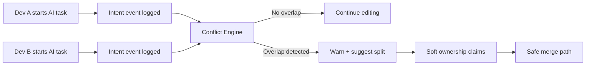
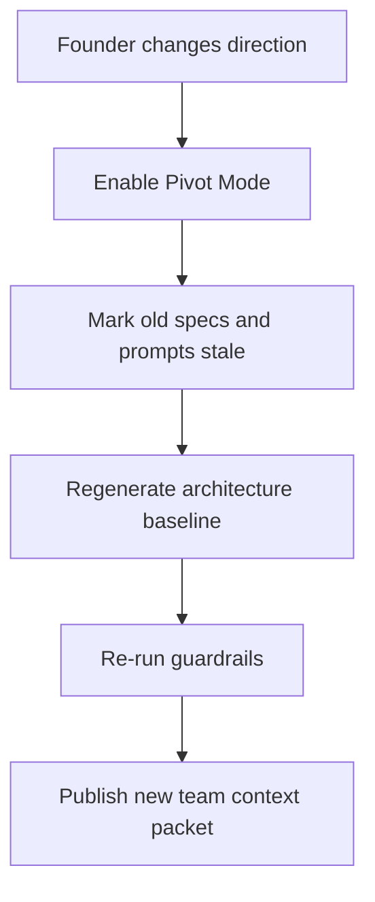
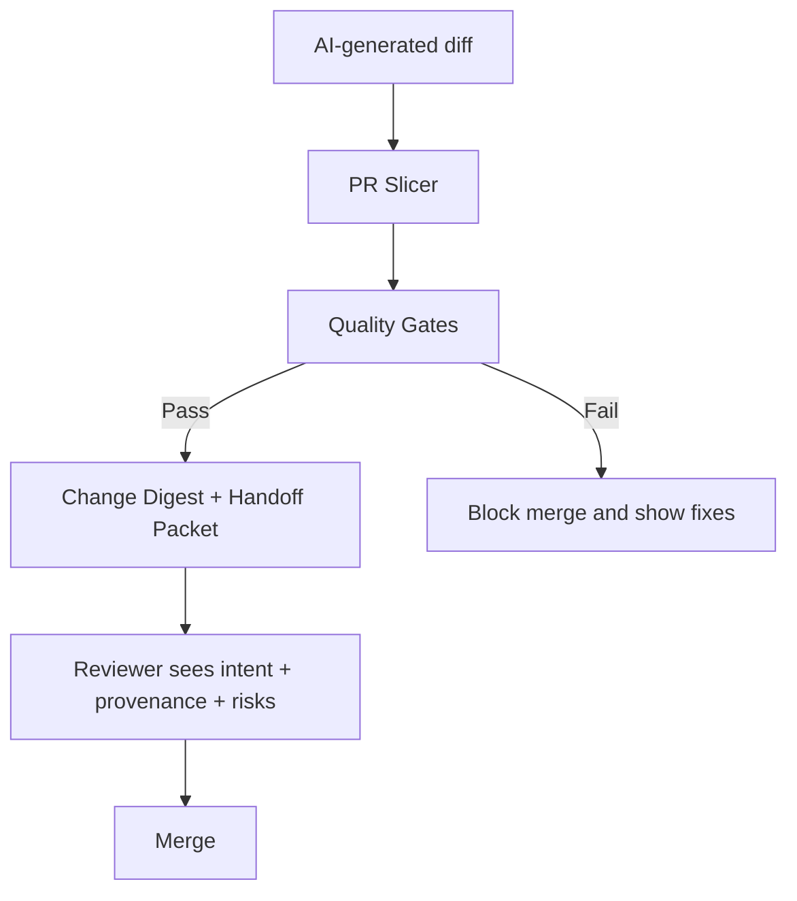
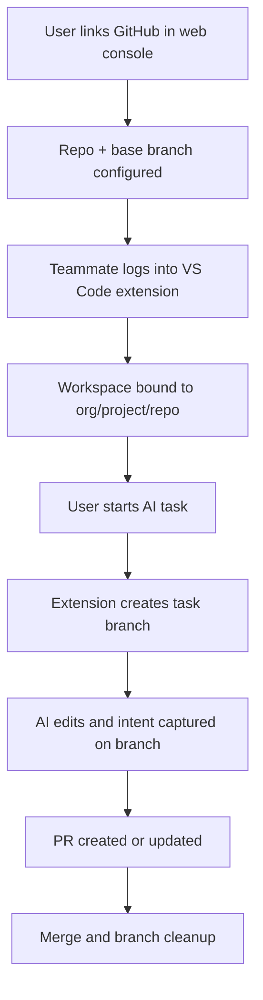

# AI-Native Collaboration: Pain Points and Project Additions

Version: 1.1  
Date: 2026-03-09  
Status: Organized and validated

## Pain Points

1. Development intent is lost (why code was generated, constraints, and alternatives).
2. Prompt knowledge is hidden in individual chats.
3. Teammates cannot see live AI work context.
4. Parallel vibe-coding causes overlap and merge conflicts.
5. Teams fall back to sequential development to avoid breakage.
6. Architecture drifts because each person or agent generates differently.
7. Fast pivots make old AI context and specs stale.
8. AI increases code volume, overwhelming pull request review.
9. Generated code quality and security are inconsistent.
10. Handoffs and onboarding are weak because "what changed and why" is missing.
11. Traceability and compliance are poor (who asked what AI, when, and what changed).
12. Tool context is fragmented across IDE, pull request, chat, and docs.
13. Good prompts and patterns are not reused team-wide.
14. Ownership is unclear during concurrent edits.

## What We Are Adding in the Project

1. Shared Intent Timeline.
   Addresses: Pain points 1, 2, 10, 11.
   Scope: Capture prompt, files touched, human edits, and final decision for each AI-assisted task.

2. Live Team Activity Map in VS Code.
   Addresses: Pain points 3, 4, 5, 14.
   Scope: Show who is editing which module, plus active AI task context.

3. Conflict Prevention Layer.
   Addresses: Pain points 4, 5, 14.
   Scope: Early overlap alerts, soft file claims, and suggested task splits.

4. Spec and Architecture Guardrails.
   Addresses: Pain points 6, 9, 13.
   Scope: Enforce repository constraints, boundaries, naming standards, and API contracts before apply.

5. Pivot Mode.
   Addresses: Pain points 7, 6, 10.
   Scope: Mark obsolete specs and intent, then regenerate the current architecture state and migration checklist.

6. PR Slicer and Change Digest.
   Addresses: Pain points 8, 10.
   Scope: Split large AI diffs into reviewable units with concise change summaries.

7. Quality Gate Agents.
   Addresses: Pain points 8, 9.
   Scope: Run tests, lint, security checks, and dependency risk checks before pull request.

8. Team Prompt and Pattern Library.
   Addresses: Pain points 2, 13, 6.
   Scope: Versioned reusable prompts and playbooks per task type.

9. One-Click Handoff Packet.
   Addresses: Pain points 1, 3, 10.
   Scope: Generate "what changed, why, constraints, risks, and next steps" for teammate handoff.

10. Replay and Provenance View.
    Addresses: Pain points 1, 2, 11.
    Scope: Replay generation and edit history per feature for debugging and trust.

11. Unified Integrations.
    Addresses: Pain point 12.
    Scope: Sync GitHub or GitLab, Linear or Jira, and Slack around a shared task or run ID.

12. Access, Policy, and Audit Controls.
    Addresses: Pain points 11, 9.
    Scope: RBAC, sensitive prompt redaction, and retention controls.

## Proposed Project and Module Structure (V1)

```text
branchline/
  docs/
    architecture/
      flows.md
  packages/
    web-console/
      src/
        app/
        modules/
          auth/
          organizations/
          projects/
          github-app-linking/
          team-management/
          repo-settings/
          policy-management/
          activity-dashboard/
          replay-dashboard/
    extension-vscode/
      src/
        extension.ts
        auth-session/
        project-selector/
        branch-orchestrator/
        activity-map/
        intent-timeline/
        conflict-prevention/
        handoff-packets/
        pivot-mode/
        guardrails/
        replay-view/
        integrations/
          github/
          gitlab/
          linear/
          jira/
          slack/
    api-server/
      src/
        routes/
        services/
          auth/
          org-projects/
          github-app/
          branch-manager/
          intent-log/
          context-sync/
          conflict-engine/
          guardrail-engine/
          handoff-engine/
          replay-engine/
          audit/
        workers/
          quality-gates/
          pr-slicer/
    shared/
      schemas/
      events/
      policy/
  infra/
    migrations/
    docker/
```

## Module Descriptions

1. `web-console/github-app-linking`
   Handles GitHub App installation, repository linking, and permission checks.

2. `web-console/organizations`, `projects`, `team-management`
   Manages orgs, projects, teammate invites, roles, and repository assignment.

3. `web-console/policy-management`
   Central policy console for branch rules, guardrails, auto-push, and PR behavior.

4. `web-console/activity-dashboard` and `replay-dashboard`
   Provides team-wide visibility into active tasks, branch state, conflicts, and replay history.

5. `extension-vscode/auth-session`
   Signs into the same account as web console and manages session/token lifecycle.

6. `extension-vscode/project-selector`
   Binds local workspace to org/project/repo selected in control plane.

7. `extension-vscode/branch-orchestrator`
   Auto-creates and manages task branches; blocks direct AI writes to protected branches.

8. `extension-vscode/activity-map`
   Shows real-time teammate + AI activity at file/module level.

9. `extension-vscode/intent-timeline`
   Captures prompt, generation metadata, edits, decisions, and links them to task IDs.

10. `extension-vscode/conflict-prevention`
    Detects overlap early, proposes split strategy, and manages soft ownership claims.

11. `extension-vscode/guardrails`
    Runs architecture/spec rules before applying AI changes.

12. `extension-vscode/handoff-packets`
    Generates one-click handoff summaries for async team continuity.

13. `extension-vscode/pivot-mode`
    Invalidates stale context/specs and creates a new baseline after strategy shifts.

14. `api-server/github-app`
    Manages GitHub webhook ingestion, installation mapping, and repository sync.

15. `api-server/branch-manager`
    Owns server-side branch policy checks, naming enforcement, and stale-branch handling.

16. `api-server/conflict-engine`
    Central conflict scoring and recommendation service for concurrent edits.

17. `api-server/guardrail-engine`
    Policy evaluator for layering, naming, boundaries, and API contract compliance.

18. `api-server/handoff-engine`
    Builds structured summaries with risk and next-step extraction.

19. `api-server/replay-engine`
    Reconstructs feature-level history from events for debugging and trust.

20. `api-server/workers/quality-gates`
    Executes tests, lint, security checks, and dependency-risk checks.

21. `api-server/workers/pr-slicer`
    Splits large AI diffs into reviewable chunks and generates digest text.

22. `packages/shared`
    Shared schemas/events to keep extension, API, and workers consistent.

## Control Plane and Execution Plane

1. Control plane: `web-console` + `api-server`.
   Scope: account login, project creation, GitHub linking, teammate access, repo policies, dashboards.

2. Execution plane: `extension-vscode`.
   Scope: local coding workflow, branch automation, intent capture, conflict warnings, and guardrail checks.

3. Contract between planes: shared org/project/repo identifiers and event schemas from `packages/shared`.

## End-to-End Product Flow

1. User signs up and creates organization/project in web console.
2. User links GitHub via GitHub App and selects repository/base branch.
3. User invites teammates and sets policies (branch naming, auto-push, PR rules).
4. Teammate installs extension and logs into same account.
5. Extension binds local workspace to organization/project/repository.
6. On "Start AI Task", extension auto-creates a task branch from latest base branch.
7. Extension captures intent and coding activity; API computes conflicts and guardrail results.
8. Console displays live status for team activity, overlaps, and PR readiness.
9. On merge, branch is closed and optional cleanup runs per policy.

## Branch Automation Specification

1. Trigger: when user starts an AI task in extension.
2. Branch source: latest protected base branch (for example `main`).
3. Branch naming: `ai/<task-or-ticket>/<slug>-<utc-timestamp>`.
4. Protection: AI edits are blocked on protected branches (`main`, `develop`, release branches).
5. Commit strategy: small intent-linked commits with run ID metadata.
6. Sync strategy: stale-base detection with safe rebase/update suggestion.
7. PR strategy: create or update PR automatically based on project policy.
8. Cleanup strategy: auto-delete merged branches and flag stale branches for review.
9. Safety: require explicit confirmation for destructive git operations.

## Flow Diagrams

### 1) Parallel Vibe-Coding with Conflict Prevention



### 2) Founder Pivot Flow



### 3) AI PR Review Flow



### 4) GitHub Link to Auto-Branch Flow


