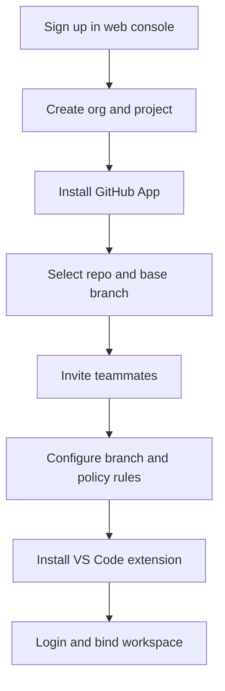
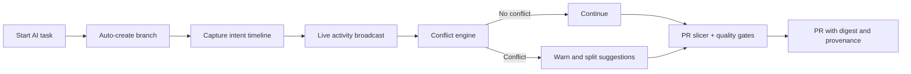
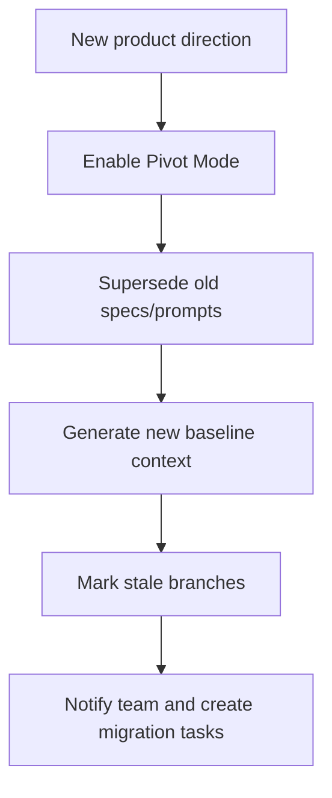

# AI-Native Team Coding Platform

## Complete Project Guideline

Version: 1.0  
Date: 2026-03-09  
Audience: Product, Engineering, Design, Founders
Status: Organized and validated

---

## 1. Project Description

### 1.1 Vision

Build an AI-native collaboration platform where teams can ship quickly with coding agents without losing architecture quality, team context, or maintainability.

### 1.2 Product Shape

The product has two planes:

1. Control plane (web console + backend): accounts, projects, GitHub linking, policies, visibility, audit.
2. Execution plane (VS Code extension): AI coding workflow, branch automation, local guardrails, intent capture, conflict prevention.

### 1.3 Core Promise

If a team uses the platform, every AI coding task becomes:

1. Isolated in a safe branch.
2. Traceable with intent and decisions.
3. Coordinated with teammates in real time.
4. Checked by architecture and quality guardrails.

### 1.4 Target Users

1. Founder-led teams (2-8 engineers) shipping fast with frequent pivots.
2. Startup engineering teams (8-30 engineers) using AI coding heavily.
3. Engineering managers who need visibility, quality, and control over AI-assisted development.

---

## 2. Problem Statement and Pain Points

## 2.1 Pain Point Catalog

1. Development intent is lost after code lands.
2. Prompt knowledge is private in individual sessions.
3. Team members lack live context on parallel AI work.
4. Parallel vibe-coding creates overlap and merge conflicts.
5. Teams become sequential to avoid breakage.
6. Architecture drifts due to inconsistent prompts and local decisions.
7. Founder pivots make prior context/specs stale.
8. AI code volume overwhelms code review.
9. Quality/security of generated code is inconsistent.
10. Handoffs are weak; onboarding is slow.
11. Audit/compliance traceability is missing.
12. Context is fragmented across IDE/PR/chat/docs.
13. Good prompts/patterns are not reusable across the team.
14. Ownership during concurrent work is unclear.

## 2.2 Root Cause Matrix

| Pain Point           | Root Cause                                 | Team Impact               | Primary KPI                    |
| -------------------- | ------------------------------------------ | ------------------------- | ------------------------------ |
| Intent loss          | Git stores code, not AI workflow           | Slow debugging, low trust | Mean time to understand change |
| Hidden prompts       | Private agent chats                        | Non-reproducible output   | Prompt reuse rate              |
| Missing live context | No shared real-time coordination           | Duplicate work            | Overlap incidents per sprint   |
| Merge conflicts      | Large multi-file AI edits                  | Integration delays        | Conflict rate per PR           |
| Sequential fallback  | Fear of collisions                         | Throughput drop           | Parallel task ratio            |
| Architecture drift   | No enforced constraints at generation time | Long-term complexity      | Guardrail violations per week  |
| Pivot staleness      | Context not versioned/invalidated          | Wrong code direction      | Pivot recovery lead time       |
| Review overload      | Diff size explosion                        | Slow merges               | PR review cycle time           |
| Inconsistent quality | Missing automated policy gates             | Regressions/security risk | Defect escape rate             |
| Weak handoffs        | No standardized change summary             | Onboarding burden         | Handoff completion score       |
| Poor traceability    | No provenance model                        | Compliance gaps           | Audit completeness             |
| Tool fragmentation   | Unlinked systems                           | Context switching         | Context switch count/task      |
| Low reuse            | No team prompt library                     | Inconsistent outputs      | Prompt template adoption       |
| Ownership ambiguity  | No active ownership signals                | Conflict and confusion    | Unowned hot-file incidents     |

---

## 3. Product Principles

1. Branch-first safety: no AI writes to protected branches.
2. Intent-first collaboration: capture why, not just what.
3. Low-friction adoption: setup in under 10 minutes.
4. Team visibility by default: show active work and conflicts early.
5. Policy before merge: architecture and quality checks are mandatory.
6. Privacy by default: metadata capture enabled, code capture opt-in.

---

## 4. Feature Set (Detailed)

## 4.1 Feature Map

1. Web console auth, organizations, projects, teammate management.
2. GitHub App linking and repository mapping.
3. VS Code account login and workspace-project binding.
4. Branch orchestration (auto-create/manage task branches).
5. Shared intent timeline.
6. Live team activity map.
7. Conflict prevention engine.
8. Spec and architecture guardrails.
9. Pivot mode.
10. PR slicer and change digest.
11. Quality gate agents.
12. Team prompt and pattern library.
13. Handoff packet generator.
14. Replay and provenance viewer.
15. Unified integrations (GitHub/GitLab, Linear/Jira, Slack).
16. Access control, policy management, audit.

## 4.2 Detailed Feature Specifications

### F1. Auth, Organizations, Projects, Team Management

Purpose: Establish secure tenant boundaries and collaboration context.

Implementation:

1. Support email/password + OAuth (Google, GitHub).
2. Organization with role-based membership: Owner, Admin, Member, Viewer.
3. Project entity tied to org and repositories.
4. Invite flow with expiring invite links.

Acceptance:

1. User can create org and project in less than 2 minutes.
2. Role permissions correctly block unauthorized actions.

### F2. GitHub App Linking

Purpose: Secure repo access without personal access token sprawl.

Implementation:

1. Use GitHub App installation flow from web console.
2. Store installation ID per org/project/repo.
3. Subscribe to webhooks: push, pull_request, check_run, check_suite, installation.
4. Map repository default branch and protected branch rules.

Acceptance:

1. Linked repo appears in project settings within 10 seconds of installation.
2. Webhooks are validated with signature verification.

### F3. Extension Login and Project Binding

Purpose: Connect local workspace to control-plane project identity.

Implementation:

1. OAuth device flow login in extension.
2. Project selector resolves org/project/repo mapping.
3. Persist selected project in VS Code workspace state.

Acceptance:

1. User logs in once and remains authenticated across sessions until token expiry.
2. Wrong repo-project mapping is flagged before AI task starts.

### F4. Branch Orchestration

Purpose: Make AI coding maintainable by default.

Implementation:

1. Trigger on "Start AI Task".
2. Fetch base branch (`main` by policy).
3. Create branch with format `ai/<task-or-ticket>/<slug>-<utc-timestamp>`.
4. Block AI edits on protected branches.
5. Commit with metadata trailer:
   1. `X-Collab-Run-Id`
   2. `X-Collab-Task-Id`
   3. `X-Collab-Intent-Id`
6. Auto-create or auto-update PR by project policy.
7. Cleanup merged branch if enabled.

Acceptance:

1. 100% of AI tasks execute on non-protected branches.
2. Branch naming and metadata trailers are enforced.

### F5. Shared Intent Timeline

Purpose: Preserve reasoning and context for every meaningful change.

Implementation:

1. Capture event sequence:
   1. Task started.
   2. Prompt submitted.
   3. Files generated/edited.
   4. Human modifications.
   5. Decision note.
   6. PR/merge linkage.
2. Render timeline in extension and web console.
3. Link each timeline to branch, commits, PR.

Acceptance:

1. Reviewer can reconstruct task intent in under 2 minutes.

### F6. Live Team Activity Map

Purpose: Prevent blind parallel work and duplicate effort.

Implementation:

1. Broadcast active files/modules per user in real time.
2. Show user state: planning, generating, editing, testing, reviewing.
3. Add module heatmap for hot zones.

Acceptance:

1. Active teammate context updates in under 2 seconds.

### F7. Conflict Prevention Engine

Purpose: Detect and reduce collisions before merge time.

Implementation:

1. Compute overlap score from:
   1. File overlap.
   2. Symbol overlap.
   3. Guardrail boundary overlap.
2. On threshold breach, extension warns and offers:
   1. Split suggestion.
   2. Ownership claim.
   3. Rebase suggestion.

Acceptance:

1. Merge conflict rate drops by at least 30% from baseline in pilot teams.

### F8. Spec and Architecture Guardrails

Purpose: Keep fast AI coding aligned with system design.

Implementation:

1. Policy file per repo (for example `.branchline/policy.yaml`).
2. Rules:
   1. Layer boundaries.
   2. Path ownership constraints.
   3. Naming conventions.
   4. API contract constraints.
3. Enforcement points:
   1. Pre-apply in extension.
   2. Pre-PR via worker.

Acceptance:

1. Policy violations are visible before PR creation.

### F9. Pivot Mode

Purpose: Recover safely when product direction changes quickly.

Implementation:

1. Mark previous specs/intents as superseded.
2. Generate fresh baseline context packet.
3. Flag stale branches and stale prompts.
4. Suggest migration tasks for open branches.

Acceptance:

1. Team can re-align within one working day after a major pivot.

### F10. PR Slicer and Change Digest

Purpose: Make large AI diffs reviewable.

Implementation:

1. Group changes by subsystem and risk level.
2. Split huge changes into stacked PR suggestions.
3. Generate digest: purpose, high-risk files, open questions.

Acceptance:

1. Median PR review time decreases for AI-heavy changes.

### F11. Quality Gate Agents

Purpose: Enforce quality/security automatically.

Implementation:

1. Worker pipeline:
   1. Build.
   2. Unit tests.
   3. Lint/format.
   4. SAST/dependency audit.
   5. Optional integration tests.
2. Policy-configurable required checks per repo.

Acceptance:

1. PR cannot merge when required gates fail.

### F12. Team Prompt and Pattern Library

Purpose: Reuse what works and reduce output variance.

Implementation:

1. Versioned prompt templates at org/project scope.
2. Tags by task type: API, migration, tests, bugfix.
3. Performance stats by template usage.

Acceptance:

1. Reused template rate increases sprint-over-sprint.

### F13. Handoff Packets

Purpose: Make async collaboration predictable.

Implementation:

1. One-click packet generation at task pause/finish.
2. Packet contents:
   1. Summary.
   2. Constraints.
   3. Risks.
   4. TODOs.
   5. Relevant commits/files.

Acceptance:

1. Another teammate can resume task without direct chat.

### F14. Replay and Provenance

Purpose: Build trust and improve debugging.

Implementation:

1. Reconstruct timeline from events + commit metadata.
2. Replay UI by task/branch/PR.
3. Export audit-friendly provenance report.

Acceptance:

1. Auditors can answer "who changed what, why, and when" for any merged task.

### F15. Unified Integrations

Purpose: Keep context synced across tools.

Implementation:

1. GitHub/GitLab for code + PR events.
2. Linear/Jira for ticket linkage.
3. Slack for notifications and handoff delivery.

Acceptance:

1. Every task has linked entities across code, ticket, and conversation.

### F16. Access, Policy, Audit Controls

Purpose: Enterprise-readiness and safe AI adoption.

Implementation:

1. RBAC and project-scoped permissions.
2. Sensitive prompt redaction pipeline.
3. Configurable retention windows.
4. Immutable audit logs.

Acceptance:

1. Security posture meets baseline enterprise requirements.

---

## 5. End-to-End Flows

### 5.1 Onboarding and Setup



### 5.2 Parallel AI Coding Flow



### 5.3 Founder Pivot Flow



---

## 6. Tech Stack Decisions

## 6.1 Web Console Frontend

Chosen stack:

1. Next.js 15 (App Router) + React 19 + TypeScript.
2. Tailwind CSS + shadcn/ui for fast, consistent UI.
3. TanStack Query for server state.
4. Zustand for lightweight client state.
5. Recharts or ECharts for activity dashboards.

Why:

1. Mature ecosystem, fast iteration, strong auth/integration support.
2. Good DX for product-heavy SaaS console.

## 6.2 Backend API

Chosen stack:

1. NestJS (TypeScript) with Fastify adapter.
2. Prisma ORM.
3. PostgreSQL 16 (primary relational store).
4. Redis 7 (cache, rate limit, ephemeral state).
5. BullMQ for asynchronous jobs.
6. Socket.IO (or native WebSocket gateway) for real-time activity updates.

Why:

1. Modular architecture maps well to many domain services.
2. Type-safe across frontend/backend/extension.
3. Good support for webhooks, queues, and event-driven workflows.

## 6.3 VS Code Extension

Chosen stack:

1. TypeScript + VS Code Extension API.
2. Node.js child process for Git CLI interactions.
3. Webview UI using React + Vite for richer panels where needed.
4. Zod for local schema validation of API payloads.

Why:

1. Native fit for VS Code.
2. Full control over branch operations and local workspace integration.

## 6.4 GitHub Integration

Chosen stack:

1. GitHub App model (not PAT model).
2. Octokit SDK for API calls.
3. Webhook processing with signature verification.

Why:

1. Better org-level security and revocability.
2. Cleaner permission management for teams.

## 6.5 Data, Storage, and Analytics

Chosen stack:

1. PostgreSQL for transactional records.
2. S3-compatible object storage for large artifacts (replay snapshots, exports).
3. ClickHouse (Phase 2) for high-volume event analytics.

Why:

1. Start simple with Postgres.
2. Move heavy analytics to columnar store when scale demands it.

## 6.6 Auth and Identity

Chosen stack:

1. Auth.js or Clerk (pick one at implementation kickoff).
2. JWT access tokens + rotating refresh tokens.
3. Org/project RBAC in backend.

Recommendation:

1. Use Clerk for MVP speed.
2. Revisit self-hosted Auth.js if strict enterprise constraints appear.

## 6.7 AI Provider Layer

Chosen stack:

1. Provider abstraction service in backend.
2. Support OpenAI and Anthropic in MVP.
3. Log model, token usage, latency, and run IDs.

Why:

1. Avoid vendor lock-in.
2. Enable policy routing by task type.

## 6.8 Observability and Operations

Chosen stack:

1. OpenTelemetry instrumentation.
2. Sentry for application errors.
3. Prometheus + Grafana for metrics.
4. Loki (or cloud logging) for centralized logs.

## 6.9 Infrastructure and Deployment

Chosen stack:

1. Docker for local and CI reproducibility.
2. Kubernetes (or ECS/Fargate) for production.
3. Terraform for infra-as-code.
4. GitHub Actions for CI/CD.

MVP alternative:

1. Deploy on Railway/Render/Fly for speed before moving to Kubernetes.

---

## 7. Proposed Monorepo Structure

```text
branchline/
  apps/
    web-console/
    api-server/
    worker/
    vscode-extension/
  packages/
    ui/
    shared-types/
    shared-events/
    policy-engine/
    git-utils/
  docs/
    product/
    architecture/
    runbooks/
  infra/
    terraform/
    docker/
  .github/
    workflows/
```

---

## 8. Data Model (Core Entities)

Core tables:

1. `users`
2. `organizations`
3. `organization_members`
4. `projects`
5. `repositories`
6. `github_installations`
7. `tasks`
8. `branches`
9. `intent_events`
10. `conflict_events`
11. `guardrail_results`
12. `quality_gate_runs`
13. `handoff_packets`
14. `replay_sessions`
15. `prompt_templates`
16. `audit_logs`

Key notes:

1. `intent_events` is append-only.
2. `audit_logs` is immutable.
3. `branches` links task, repo, base branch, PR number, lifecycle status.

---

## 9. API and Event Contracts

## 9.1 REST API (examples)

1. `POST /v1/orgs`
2. `POST /v1/projects`
3. `POST /v1/github/installations/sync`
4. `POST /v1/tasks/start`
5. `POST /v1/tasks/{id}/handoff`
6. `POST /v1/branches/create`
7. `POST /v1/branches/{id}/sync`
8. `POST /v1/guardrails/evaluate`
9. `POST /v1/quality-gates/run`
10. `GET /v1/replay/{taskId}`

## 9.2 WebSocket Events (examples)

1. `activity.user_state_changed`
2. `activity.file_focus_changed`
3. `conflict.detected`
4. `branch.status_changed`
5. `quality_gate.completed`
6. `handoff.created`
7. `pivot.mode_enabled`

## 9.3 Extension Event Envelope

```json
{
  "eventId": "uuid",
  "orgId": "org_x",
  "projectId": "proj_x",
  "repoId": "repo_x",
  "taskId": "task_x",
  "branchName": "ai/task/slug-20260309T103000Z",
  "eventType": "intent.prompt_submitted",
  "timestamp": "2026-03-09T10:30:00Z",
  "payload": {}
}
```

---

## 10. Branch Automation Specification (Definitive)

1. Branch creation trigger:
   1. User clicks `Start AI Task`.
   2. Extension verifies clean git state or offers stash flow.
2. Branch naming:
   1. `ai/<ticket-or-task>/<short-slug>-<yyyymmddThhmmssZ>`.
3. Protected branch policy:
   1. Never apply AI edits directly to protected branches.
4. Commit granularity:
   1. Commit at meaningful checkpoints.
   2. Attach metadata trailers for provenance.
5. Base-branch freshness:
   1. Warn if base branch head has advanced beyond threshold.
   2. Offer guided rebase or merge-from-base.
6. PR policy:
   1. Auto-create PR after first successful quality gate.
   2. Auto-update PR description with intent digest.
7. Branch cleanup:
   1. Delete merged branches when policy allows.
   2. Flag stale branches after inactivity threshold.
8. Safety rules:
   1. Destructive git operations require explicit confirmation.

---

## 11. Security and Privacy Model

1. Data minimization:
   1. Default to metadata capture.
   2. Code/prompt content capture controlled by org policy.
2. Encryption:
   1. TLS in transit.
   2. AES-256 at rest for database and object storage.
3. Secrets:
   1. Store in cloud secret manager.
4. Access control:
   1. RBAC + project-scoped permissions.
5. Audit:
   1. Immutable audit events for auth, policy, and branch actions.
6. Compliance readiness:
   1. SOC 2 aligned controls in roadmap.

---

## 12. Quality Strategy

1. Unit tests:
   1. All policy engines and branch-manager logic.
2. Integration tests:
   1. GitHub webhook ingestion and repo mapping.
3. Extension E2E tests:
   1. Branch creation, conflict warnings, handoff generation.
4. Contract tests:
   1. Shared schemas between extension and backend.
5. Load tests:
   1. Realtime activity stream and queue throughput.

Tooling:

1. Vitest/Jest for unit tests.
2. Playwright for web console E2E.
3. VS Code Extension Test Runner for extension flows.
4. k6 for load testing.

---

## 13. Delivery Roadmap

## Phase 0 (Week 1-2): Foundations

1. Monorepo setup.
2. Auth, org/project basics.
3. GitHub App linking.
4. Extension login + project binding.

Exit criteria:

1. Team can create project, link repo, login from extension.

## Phase 1 (Week 3-5): Core Collaboration Loop

1. Branch orchestrator.
2. Intent timeline ingestion and UI.
3. Live activity map.
4. Basic conflict detection.

Exit criteria:

1. Parallel coding with auto-branching and shared context works.

## Phase 2 (Week 6-8): Quality and Review

1. Guardrail engine.
2. Quality gate workers.
3. PR slicer and digest.
4. Handoff packets.

Exit criteria:

1. Teams can create reviewable PRs with policy and quality checks.

## Phase 3 (Week 9-10): Pivot and Provenance

1. Pivot mode.
2. Replay and provenance views.
3. Audit export.

Exit criteria:

1. Full traceability and pivot recovery workflows available.

---

## 14. Success Metrics

Primary metrics:

1. Merge conflict rate per 100 PRs.
2. Median PR review cycle time.
3. Time-to-handoff completion.
4. Guardrail violation trend.
5. Defect escape rate.
6. Parallel task ratio.

Adoption metrics:

1. Weekly active extension users per project.
2. Percentage of AI tasks started via platform.
3. Prompt template reuse rate.

---

## 15. Risks and Mitigations

1. Risk: Extension perceived as intrusive.
   Mitigation: Transparent controls, opt-out toggles, clear status UI.

2. Risk: Git edge cases break automation.
   Mitigation: Safe-mode fallbacks and explicit confirmations.

3. Risk: High event volume and storage cost.
   Mitigation: Retention tiers, compression, archival policies.

4. Risk: Policy fatigue from false positives.
   Mitigation: Severity tiers and policy simulation mode.

5. Risk: Team adoption friction.
   Mitigation: 10-minute quickstart, defaults that require minimal configuration.

---

## 16. Implementation Checklist

Product checklist:

1. Finalize MVP scope for first design partner.
2. Confirm role model and policy defaults.
3. Freeze branch naming and PR automation policy.

Engineering checklist:

1. Define shared schemas (`shared-types`, `shared-events`).
2. Implement GitHub App + webhook verification first.
3. Implement branch orchestration before advanced agent features.
4. Build observability from day one.

Go-to-market checklist:

1. Prepare installation docs for GitHub App + extension.
2. Define pilot onboarding runbook.
3. Publish privacy and data handling policy.

---

## 17. Non-Goals for MVP

1. Building a full standalone AI coding IDE.
2. Supporting every VCS provider in first release.
3. Deep enterprise compliance certifications in MVP.
4. Multi-repo monolith-wide orchestration beyond core pilot use cases.

---

## 18. Final Recommendation

Start with the smallest loop that proves value:

1. GitHub link in console.
2. Extension login and project binding.
3. Auto task branch creation.
4. Intent capture.
5. Live overlap warnings.
6. PR digest with basic quality gates.

If this loop works reliably, the platform will already solve the most painful team-level AI coding failures and create a strong foundation for advanced collaboration features.
