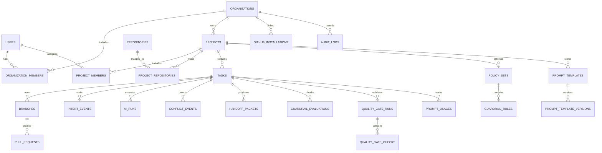

# AI-Native Team Coding Platform

## Technical Stack and Data Model Specification

Version: 1.0  
Date: 2026-03-09  
Status: Proposed baseline architecture for MVP through v1
Project: Branchline

---

## 1. Scope of This Document

This document defines:

1. The exact technology stack for each product surface.
2. The backend service architecture and module boundaries.
3. The complete database model for all major product features.
4. Event contracts and storage strategy for real-time collaboration.
5. Feature-to-model mapping so implementation is directly actionable.

This document does not define:

1. UI mockups and visual design.
2. Pricing and GTM strategy.
3. Vendor contract details.

---

## 2. Architecture Summary

The product has two planes.

1. Control plane:
   1. `web-console` for admins and teams.
   2. `api-server` for auth, policies, integrations, orchestration.
2. Execution plane:
   1. `vscode-extension` for day-to-day AI coding workflows.
   2. Local git operations + branch automation + intent capture.

System style:

1. Modular monolith backend for MVP (NestJS modules).
2. Async workers for long-running tasks.
3. Event-driven real-time updates for activity and conflicts.

---

## 3. Final Tech Stack Decisions

## 3.1 Monorepo and Developer Tooling

1. Monorepo: `pnpm` workspaces + `Turborepo`.
2. Language: TypeScript (strict mode) across frontend, backend, extension.
3. Runtime: Node.js 22 LTS.
4. Lint/format: ESLint + Prettier.
5. Type sharing: `packages/shared-types` and `packages/shared-events`.
6. API contracts: OpenAPI (Swagger) generated from backend decorators.
7. Validation: Zod for client-side validation, class-validator on backend DTOs.
8. Package releases: Changesets.
9. Commit hygiene: Conventional Commits + commitlint + husky hooks.

Why:

1. Single language lowers cognitive load.
2. Shared types reduce API drift.
3. Turborepo speeds CI and local development.

## 3.2 Web Console (Frontend)

1. Framework: Next.js 15 (App Router), React 19, TypeScript.
2. UI: Tailwind CSS + shadcn/ui.
3. State:
   1. Server state: TanStack Query.
   2. Client state: Zustand.
4. Forms: React Hook Form + Zod resolver.
5. Charts: ECharts (activity/conflict dashboards).
6. Realtime client: Socket.IO client.
7. Auth integration: Clerk frontend SDK.

Why:

1. Fast product iteration.
2. Strong support for authenticated SaaS dashboards.
3. Reliable ecosystem for enterprise-style settings pages.

## 3.3 VS Code Extension

1. Extension core: VS Code Extension API + TypeScript.
2. Webview UI: React + Vite build pipeline.
3. Local git operations: native git CLI via `execa`.
4. Local persistence:
   1. VS Code `Memento` for workspace settings.
   2. Encrypted `SecretStorage` for tokens if needed.
5. Networking: Axios with retry policy + offline queue.
6. Real-time updates: WebSocket client (Socket.IO protocol).
7. Schema validation: Zod for every outbound event envelope.

Why:

1. Full control of git branch lifecycle.
2. Reliable handling of edge-case local repo states.

## 3.4 Backend API and Domain Services

1. Framework: NestJS with Fastify adapter.
2. ORM: Prisma.
3. Database: PostgreSQL 16.
4. Caching and ephemeral state: Redis 7.
5. Queue: BullMQ.
6. Realtime gateway: Socket.IO.
7. Integrations:
   1. GitHub: Octokit + GitHub App auth.
   2. Slack: Slack Web API.
   3. Linear/Jira: REST API adapters.
8. File and report storage: S3-compatible object storage.

Why:

1. Nest module boundaries map directly to feature domains.
2. Queue + Redis supports heavy async operations.
3. GitHub App integration is secure and org-friendly.

## 3.5 Worker Stack

Workers run as separate deployment units:

1. `quality-gate-worker`.
2. `pr-slicer-worker`.
3. `handoff-worker`.
4. `analytics-rollup-worker`.

Worker runtime:

1. Node.js + BullMQ consumers.
2. Dockerized with horizontal autoscaling by queue depth.

## 3.6 Authentication and Authorization

1. Identity provider: Clerk (MVP default).
2. Token model:
   1. Short-lived access token.
   2. Rotating refresh token.
3. Authorization:
   1. Org-level roles: Owner/Admin/Member/Viewer.
   2. Project-level overrides.
4. Service auth:
   1. Signed service tokens for extension-to-API calls.

## 3.7 Observability and Reliability

1. Tracing: OpenTelemetry.
2. Error tracking: Sentry.
3. Metrics: Prometheus + Grafana.
4. Logs: Loki or managed logging.
5. Alerts: PagerDuty/Opsgenie integration.

## 3.8 Infrastructure and Deployment

1. Containerization: Docker.
2. Orchestration: Kubernetes (or ECS Fargate for MVP).
3. IaC: Terraform.
4. CI/CD: GitHub Actions.
5. Secrets: AWS Secrets Manager or GCP Secret Manager.
6. CDN and edge: Cloudflare.

---

## 4. Service and Module Layout

## 4.1 Apps

```text
apps/
  web-console
  api-server
  worker
  vscode-extension
```

## 4.2 Shared Packages

```text
packages/
  shared-types
  shared-events
  policy-engine
  git-utils
  ui
```

## 4.3 Backend Domain Modules

```text
api-server/src/modules/
  auth
  organizations
  projects
  memberships
  github-app
  repositories
  tasks
  branches
  intent
  activity
  conflicts
  guardrails
  quality-gates
  prompt-library
  handoffs
  replay
  pivot
  integrations
  notifications
  audit
```

---

## 5. Feature to Technology Mapping

| Feature                      | Frontend/Extension                    | Backend Modules                        | Queue Workers         | Core Tables                                                     |
| ---------------------------- | ------------------------------------- | -------------------------------------- | --------------------- | --------------------------------------------------------------- |
| Auth and org setup           | Next.js auth pages                    | `auth`, `organizations`, `memberships` | -                     | `users`, `organizations`, `organization_members`                |
| GitHub linking               | Web console settings                  | `github-app`, `repositories`           | webhook processor     | `github_installations`, `repositories`, `project_repositories`  |
| Project binding in extension | Extension login + selector            | `projects`, `repositories`             | -                     | `workspace_bindings`, `projects`                                |
| Auto branch creation         | Extension branch orchestrator         | `branches`, `tasks`                    | -                     | `tasks`, `branches`, `pull_requests`                            |
| Intent timeline              | Extension event emitter + timeline UI | `intent`, `activity`                   | event normalizer      | `intent_events`, `task_decisions`, `ai_runs`                    |
| Live activity map            | Extension sidebar + web dashboard     | `activity`, `notifications`            | realtime fanout       | `activity_presence`, `activity_events`                          |
| Conflict prevention          | Extension alerts                      | `conflicts`                            | conflict scorer       | `conflict_events`, `ownership_claims`                           |
| Guardrails                   | Extension pre-apply checks            | `guardrails`                           | guardrail evaluator   | `policy_sets`, `guardrail_rules`, `guardrail_evaluations`       |
| Pivot mode                   | Console + extension command           | `pivot`, `tasks`                       | stale detector        | `pivot_events`, `stale_context_reports`                         |
| PR slicer                    | Web PR panel                          | `quality-gates`, `tasks`               | `pr-slicer-worker`    | `pr_slices`, `quality_gate_runs`                                |
| Quality gates                | Web + extension status                | `quality-gates`                        | `quality-gate-worker` | `quality_gate_runs`, `quality_gate_checks`                      |
| Prompt library               | Console prompt management             | `prompt-library`                       | analytics rollup      | `prompt_templates`, `prompt_template_versions`, `prompt_usages` |
| Handoff packets              | Extension action + web view           | `handoffs`                             | `handoff-worker`      | `handoff_packets`, `handoff_acks`                               |
| Replay/provenance            | Web replay view                       | `replay`, `audit`                      | replay materializer   | `replay_snapshots`, `audit_logs`                                |
| Integrations                 | Console settings                      | `integrations`, `notifications`        | notifier workers      | `integration_connections`, `integration_links`                  |
| Access and audit             | Console policies                      | `auth`, `audit`                        | audit exporter        | `audit_logs`, `policy_sets`                                     |

---

## 6. Database Architecture

## 6.1 Database Strategy

1. Primary OLTP: PostgreSQL 16.
2. Event-heavy tables partitioned monthly.
3. Read replicas for dashboard queries.
4. Redis as cache and transient activity store.
5. S3 object store for large replay assets and exports.
6. Required Postgres extensions:
   1. `pgcrypto` for UUID helpers and crypto utilities.
   2. `citext` for case-insensitive email/slug handling.
   3. `pg_trgm` for fast fuzzy text search on names and paths.

## 6.2 ID and Timestamp Conventions

1. Primary key type: `uuid` (generated server-side).
2. Every table has:
   1. `created_at timestamptz not null default now()`
   2. `updated_at timestamptz not null default now()`
3. Soft-delete only where needed (`deleted_at`).
4. `org_id` included in all tenant-bound tables for isolation.

## 6.3 Enum Types

Recommended enums:

1. `org_role`: `owner`, `admin`, `member`, `viewer`.
2. `project_role`: `admin`, `member`, `viewer`.
3. `task_status`: `todo`, `in_progress`, `blocked`, `review`, `done`, `archived`.
4. `branch_status`: `active`, `stale`, `merged`, `closed`, `abandoned`.
5. `pr_status`: `open`, `draft`, `merged`, `closed`.
6. `quality_status`: `queued`, `running`, `passed`, `failed`, `canceled`.
7. `conflict_severity`: `low`, `medium`, `high`, `critical`.
8. `event_source`: `extension`, `web_console`, `worker`, `webhook`.

---

## 7. Entity Relationship Overview



---

## 8. Detailed Database Models

## 8.1 Identity and Tenancy

### `users`

Purpose: Platform users.

Columns:

1. `id uuid pk`
2. `clerk_user_id text unique not null`
3. `email citext unique not null`
4. `display_name text`
5. `avatar_url text`
6. `last_login_at timestamptz`
7. `created_at timestamptz`
8. `updated_at timestamptz`

Indexes:

1. `(email)`
2. `(clerk_user_id)`

### `organizations`

Purpose: Tenant boundary.

Columns:

1. `id uuid pk`
2. `name text not null`
3. `slug citext unique not null`
4. `owner_user_id uuid not null references users(id)`
5. `plan text not null default 'free'`
6. `settings jsonb not null default '{}'::jsonb`
7. `created_at timestamptz`
8. `updated_at timestamptz`

Indexes:

1. `(slug)`
2. `(owner_user_id)`

### `organization_members`

Purpose: Org membership and role.

Columns:

1. `id uuid pk`
2. `org_id uuid not null references organizations(id)`
3. `user_id uuid not null references users(id)`
4. `role org_role not null`
5. `status text not null default 'active'`
6. `invited_by uuid references users(id)`
7. `joined_at timestamptz`
8. `created_at timestamptz`
9. `updated_at timestamptz`

Constraints:

1. `unique (org_id, user_id)`

Indexes:

1. `(org_id, role)`
2. `(user_id)`

### `projects`

Purpose: Collaboration unit under organization.

Columns:

1. `id uuid pk`
2. `org_id uuid not null references organizations(id)`
3. `name text not null`
4. `key text not null`
5. `description text`
6. `default_base_branch text not null default 'main'`
7. `settings jsonb not null default '{}'::jsonb`
8. `created_by uuid not null references users(id)`
9. `created_at timestamptz`
10. `updated_at timestamptz`

Constraints:

1. `unique (org_id, key)`

Indexes:

1. `(org_id, created_at desc)`

### `project_members`

Purpose: Optional project-scoped role override.

Columns:

1. `id uuid pk`
2. `project_id uuid not null references projects(id)`
3. `user_id uuid not null references users(id)`
4. `role project_role not null`
5. `created_at timestamptz`
6. `updated_at timestamptz`

Constraints:

1. `unique (project_id, user_id)`

---

## 8.2 Repository and GitHub Integration

### `repositories`

Purpose: Source repositories linked to projects.

Columns:

1. `id uuid pk`
2. `org_id uuid not null references organizations(id)`
3. `provider text not null` (github/gitlab)
4. `provider_repo_id text not null`
5. `owner text not null`
6. `name text not null`
7. `full_name text not null`
8. `default_branch text not null`
9. `is_private boolean not null`
10. `metadata jsonb not null default '{}'::jsonb`
11. `created_at timestamptz`
12. `updated_at timestamptz`

Constraints:

1. `unique (provider, provider_repo_id)`

Indexes:

1. `(org_id, provider)`
2. `(full_name)`

### `project_repositories`

Purpose: Many-to-many mapping project to repositories.

Columns:

1. `id uuid pk`
2. `project_id uuid not null references projects(id)`
3. `repository_id uuid not null references repositories(id)`
4. `is_primary boolean not null default false`
5. `created_at timestamptz`
6. `updated_at timestamptz`

Constraints:

1. `unique (project_id, repository_id)`

### `github_installations`

Purpose: GitHub App installation metadata.

Columns:

1. `id uuid pk`
2. `org_id uuid not null references organizations(id)`
3. `github_installation_id bigint not null`
4. `account_login text not null`
5. `account_type text not null`
6. `permissions jsonb not null`
7. `installed_by_user_id uuid references users(id)`
8. `installed_at timestamptz not null`
9. `uninstalled_at timestamptz`
10. `created_at timestamptz`
11. `updated_at timestamptz`

Constraints:

1. `unique (github_installation_id)`

Indexes:

1. `(org_id)`

### `github_webhook_deliveries`

Purpose: Idempotent webhook ingestion and retry tracking.

Columns:

1. `id uuid pk`
2. `org_id uuid references organizations(id)`
3. `delivery_id text not null`
4. `event_name text not null`
5. `signature_valid boolean not null`
6. `payload jsonb not null`
7. `processed boolean not null default false`
8. `processed_at timestamptz`
9. `error text`
10. `created_at timestamptz`

Constraints:

1. `unique (delivery_id)`

---

## 8.3 Tasks, Branches, and PR Lifecycle

### `tasks`

Purpose: Canonical unit for AI-assisted work.

Columns:

1. `id uuid pk`
2. `org_id uuid not null references organizations(id)`
3. `project_id uuid not null references projects(id)`
4. `repository_id uuid not null references repositories(id)`
5. `title text not null`
6. `description text`
7. `status task_status not null default 'todo'`
8. `created_by uuid not null references users(id)`
9. `assigned_to uuid references users(id)`
10. `external_ticket_ref text`
11. `started_at timestamptz`
12. `completed_at timestamptz`
13. `created_at timestamptz`
14. `updated_at timestamptz`

Indexes:

1. `(project_id, status)`
2. `(assigned_to, status)`
3. `(repository_id, created_at desc)`

### `branches`

Purpose: Track automated branch lifecycle.

Columns:

1. `id uuid pk`
2. `org_id uuid not null references organizations(id)`
3. `project_id uuid not null references projects(id)`
4. `repository_id uuid not null references repositories(id)`
5. `task_id uuid not null references tasks(id)`
6. `created_by uuid not null references users(id)`
7. `name text not null`
8. `base_branch text not null`
9. `head_sha text`
10. `base_sha text`
11. `status branch_status not null default 'active'`
12. `is_protected_violation boolean not null default false`
13. `stale_reason text`
14. `merged_at timestamptz`
15. `closed_at timestamptz`
16. `created_at timestamptz`
17. `updated_at timestamptz`

Constraints:

1. `unique (repository_id, name)`

Indexes:

1. `(task_id)`
2. `(project_id, status)`
3. `(repository_id, status)`

### `pull_requests`

Purpose: PR metadata and synchronization state.

Columns:

1. `id uuid pk`
2. `org_id uuid not null references organizations(id)`
3. `repository_id uuid not null references repositories(id)`
4. `branch_id uuid not null references branches(id)`
5. `provider_pr_id text not null`
6. `number integer not null`
7. `url text not null`
8. `title text not null`
9. `status pr_status not null default 'open'`
10. `is_draft boolean not null default true`
11. `mergeable_state text`
12. `opened_by uuid references users(id)`
13. `opened_at timestamptz`
14. `merged_by uuid references users(id)`
15. `merged_at timestamptz`
16. `created_at timestamptz`
17. `updated_at timestamptz`

Constraints:

1. `unique (repository_id, number)`

Indexes:

1. `(branch_id)`
2. `(status, created_at desc)`

---

## 8.4 Intent, Activity, and AI Run Provenance

### `intent_events`

Purpose: Immutable timeline of intent and execution events.

Columns:

1. `id uuid pk`
2. `org_id uuid not null references organizations(id)`
3. `project_id uuid not null references projects(id)`
4. `task_id uuid not null references tasks(id)`
5. `branch_id uuid references branches(id)`
6. `actor_user_id uuid references users(id)`
7. `source event_source not null`
8. `event_type text not null`
9. `event_seq bigint not null`
10. `payload jsonb not null`
11. `redaction_level text not null default 'none'`
12. `occurred_at timestamptz not null`
13. `created_at timestamptz`

Constraints:

1. `unique (task_id, event_seq)`

Indexes:

1. `(task_id, occurred_at)`
2. `(project_id, occurred_at desc)`
3. `gin (payload)`

Partitioning:

1. Range partition by month on `occurred_at`.

### `activity_presence`

Purpose: Current active coding state per user/workspace.

Columns:

1. `id uuid pk`
2. `org_id uuid not null references organizations(id)`
3. `project_id uuid not null references projects(id)`
4. `user_id uuid not null references users(id)`
5. `workspace_binding_id uuid`
6. `state text not null` (planning/generating/editing/testing/reviewing)
7. `active_file_path text`
8. `active_symbol text`
9. `updated_from_event_id uuid`
10. `last_seen_at timestamptz not null`
11. `created_at timestamptz`
12. `updated_at timestamptz`

Constraints:

1. `unique (project_id, user_id)`

Indexes:

1. `(project_id, last_seen_at desc)`

### `activity_events`

Purpose: Historical activity stream used for heatmaps and analytics.

Columns:

1. `id uuid pk`
2. `org_id uuid not null`
3. `project_id uuid not null`
4. `task_id uuid`
5. `user_id uuid`
6. `event_type text not null`
7. `file_path text`
8. `symbol text`
9. `payload jsonb not null`
10. `occurred_at timestamptz not null`
11. `created_at timestamptz`

Indexes:

1. `(project_id, occurred_at desc)`
2. `(file_path, occurred_at desc)`

### `ai_runs`

Purpose: One record per AI execution context.

Columns:

1. `id uuid pk`
2. `org_id uuid not null`
3. `project_id uuid not null`
4. `task_id uuid not null references tasks(id)`
5. `branch_id uuid references branches(id)`
6. `provider text not null`
7. `model text not null`
8. `input_tokens integer`
9. `output_tokens integer`
10. `latency_ms integer`
11. `cost_usd numeric(12,6)`
12. `status text not null`
13. `started_at timestamptz not null`
14. `ended_at timestamptz`
15. `created_at timestamptz`

Indexes:

1. `(task_id, started_at desc)`
2. `(project_id, provider, model)`

### `task_decisions`

Purpose: Human decision checkpoints for why choices were made.

Columns:

1. `id uuid pk`
2. `org_id uuid not null`
3. `project_id uuid not null`
4. `task_id uuid not null references tasks(id)`
5. `decision_type text not null`
6. `summary text not null`
7. `rationale text`
8. `decided_by uuid references users(id)`
9. `related_event_id uuid references intent_events(id)`
10. `created_at timestamptz`
11. `updated_at timestamptz`

Indexes:

1. `(task_id, created_at desc)`

---

## 8.5 Conflict Detection and Ownership

### `conflict_events`

Purpose: Detected overlap and conflict risk.

Columns:

1. `id uuid pk`
2. `org_id uuid not null`
3. `project_id uuid not null`
4. `repository_id uuid not null`
5. `task_id uuid references tasks(id)`
6. `other_task_id uuid references tasks(id)`
7. `severity conflict_severity not null`
8. `score numeric(5,2) not null`
9. `reason_codes text[] not null`
10. `file_paths text[]`
11. `symbol_names text[]`
12. `resolution_status text not null default 'open'`
13. `resolved_by uuid references users(id)`
14. `resolved_at timestamptz`
15. `created_at timestamptz`

Indexes:

1. `(project_id, resolution_status, severity)`
2. `gin (file_paths)`

### `ownership_claims`

Purpose: Temporary soft ownership locks to reduce collisions.

Columns:

1. `id uuid pk`
2. `org_id uuid not null`
3. `project_id uuid not null`
4. `task_id uuid not null references tasks(id)`
5. `user_id uuid not null references users(id)`
6. `scope_type text not null` (file/module/path-prefix)
7. `scope_value text not null`
8. `expires_at timestamptz not null`
9. `released_at timestamptz`
10. `created_at timestamptz`
11. `updated_at timestamptz`

Indexes:

1. `(project_id, scope_type, scope_value)`
2. `(expires_at)`

---

## 8.6 Policy, Guardrails, and Quality

### `policy_sets`

Purpose: Project-level policy versions.

Columns:

1. `id uuid pk`
2. `org_id uuid not null`
3. `project_id uuid not null references projects(id)`
4. `name text not null`
5. `version integer not null`
6. `status text not null` (draft/active/archived)
7. `config jsonb not null`
8. `created_by uuid references users(id)`
9. `created_at timestamptz`
10. `updated_at timestamptz`

Constraints:

1. `unique (project_id, name, version)`

Indexes:

1. `(project_id, status)`

### `guardrail_rules`

Purpose: Individual enforceable constraints under a policy set.

Columns:

1. `id uuid pk`
2. `policy_set_id uuid not null references policy_sets(id)`
3. `rule_key text not null`
4. `rule_type text not null`
5. `severity text not null`
6. `expression jsonb not null`
7. `enabled boolean not null default true`
8. `created_at timestamptz`
9. `updated_at timestamptz`

Constraints:

1. `unique (policy_set_id, rule_key)`

### `guardrail_evaluations`

Purpose: Evaluation results per task/run.

Columns:

1. `id uuid pk`
2. `org_id uuid not null`
3. `project_id uuid not null`
4. `task_id uuid not null references tasks(id)`
5. `branch_id uuid references branches(id)`
6. `policy_set_id uuid not null references policy_sets(id)`
7. `status text not null` (pass/warn/fail)
8. `violations jsonb not null`
9. `evaluated_at timestamptz not null`
10. `created_at timestamptz`

Indexes:

1. `(task_id, evaluated_at desc)`
2. `(project_id, status)`

### `quality_gate_runs`

Purpose: One pipeline execution for quality checks.

Columns:

1. `id uuid pk`
2. `org_id uuid not null`
3. `project_id uuid not null`
4. `task_id uuid not null references tasks(id)`
5. `branch_id uuid references branches(id)`
6. `trigger_source text not null` (manual/pr/auto)
7. `status quality_status not null default 'queued'`
8. `started_at timestamptz`
9. `ended_at timestamptz`
10. `summary jsonb not null default '{}'::jsonb`
11. `created_at timestamptz`
12. `updated_at timestamptz`

Indexes:

1. `(task_id, created_at desc)`
2. `(project_id, status)`

### `quality_gate_checks`

Purpose: Individual check results under a run.

Columns:

1. `id uuid pk`
2. `run_id uuid not null references quality_gate_runs(id)`
3. `check_key text not null` (unit_tests/lint/sast/dependency)
4. `status quality_status not null`
5. `duration_ms integer`
6. `details jsonb not null default '{}'::jsonb`
7. `log_url text`
8. `created_at timestamptz`
9. `updated_at timestamptz`

Constraints:

1. `unique (run_id, check_key)`

### `pr_slices`

Purpose: Review chunks created from large AI pull requests.

Columns:

1. `id uuid pk`
2. `org_id uuid not null`
3. `project_id uuid not null`
4. `task_id uuid not null references tasks(id)`
5. `pull_request_id uuid not null references pull_requests(id)`
6. `slice_order integer not null`
7. `title text not null`
8. `description text`
9. `file_paths text[] not null`
10. `risk_level text not null` (low/medium/high)
11. `status text not null default 'open'`
12. `created_at timestamptz`
13. `updated_at timestamptz`

Constraints:

1. `unique (pull_request_id, slice_order)`

Indexes:

1. `(pull_request_id, slice_order)`
2. `gin (file_paths)`

---

## 8.7 Prompt Library and Reuse Tracking

### `prompt_templates`

Purpose: Reusable prompt templates at org/project scope.

Columns:

1. `id uuid pk`
2. `org_id uuid not null`
3. `project_id uuid references projects(id)`
4. `name text not null`
5. `slug text not null`
6. `category text not null`
7. `is_active boolean not null default true`
8. `created_by uuid references users(id)`
9. `created_at timestamptz`
10. `updated_at timestamptz`

Constraints:

1. `unique (org_id, project_id, slug)`

### `prompt_template_versions`

Purpose: Version history of each template.

Columns:

1. `id uuid pk`
2. `template_id uuid not null references prompt_templates(id)`
3. `version integer not null`
4. `content text not null`
5. `variables jsonb not null default '[]'::jsonb`
6. `changelog text`
7. `created_by uuid references users(id)`
8. `created_at timestamptz`

Constraints:

1. `unique (template_id, version)`

### `prompt_usages`

Purpose: Usage analytics and effectiveness signals.

Columns:

1. `id uuid pk`
2. `org_id uuid not null`
3. `project_id uuid`
4. `task_id uuid references tasks(id)`
5. `template_id uuid references prompt_templates(id)`
6. `template_version_id uuid references prompt_template_versions(id)`
7. `ai_run_id uuid references ai_runs(id)`
8. `used_by uuid references users(id)`
9. `success_rating integer`
10. `created_at timestamptz`

Indexes:

1. `(template_id, created_at desc)`
2. `(project_id, created_at desc)`

---

## 8.8 Handoff and Replay

### `handoff_packets`

Purpose: Structured handoff payloads for async continuation.

Columns:

1. `id uuid pk`
2. `org_id uuid not null`
3. `project_id uuid not null`
4. `task_id uuid not null references tasks(id)`
5. `branch_id uuid references branches(id)`
6. `generated_by uuid references users(id)`
7. `summary text not null`
8. `constraints text`
9. `risks text`
10. `next_steps text`
11. `payload jsonb not null`
12. `created_at timestamptz`
13. `updated_at timestamptz`

Indexes:

1. `(task_id, created_at desc)`

### `handoff_acks`

Purpose: Track acknowledgment and adoption of handoff packets.

Columns:

1. `id uuid pk`
2. `handoff_packet_id uuid not null references handoff_packets(id)`
3. `ack_by uuid not null references users(id)`
4. `ack_at timestamptz not null`
5. `notes text`
6. `created_at timestamptz`

Constraints:

1. `unique (handoff_packet_id, ack_by)`

### `replay_snapshots`

Purpose: Materialized replay data for fast UI rendering/export.

Columns:

1. `id uuid pk`
2. `org_id uuid not null`
3. `project_id uuid not null`
4. `task_id uuid not null references tasks(id)`
5. `snapshot_version integer not null`
6. `snapshot jsonb not null`
7. `artifact_url text`
8. `created_at timestamptz`

Constraints:

1. `unique (task_id, snapshot_version)`

Indexes:

1. `(task_id, snapshot_version desc)`

---

## 8.9 Pivot Mode

### `pivot_events`

Purpose: Capture strategic direction changes and scope resets.

Columns:

1. `id uuid pk`
2. `org_id uuid not null`
3. `project_id uuid not null references projects(id)`
4. `triggered_by uuid references users(id)`
5. `title text not null`
6. `description text`
7. `baseline_payload jsonb not null`
8. `effective_at timestamptz not null`
9. `created_at timestamptz`

Indexes:

1. `(project_id, effective_at desc)`

### `stale_context_reports`

Purpose: List impacted tasks/branches/prompts after pivot.

Columns:

1. `id uuid pk`
2. `pivot_event_id uuid not null references pivot_events(id)`
3. `entity_type text not null` (task/branch/prompt)
4. `entity_id uuid not null`
5. `reason text not null`
6. `status text not null default 'open'`
7. `created_at timestamptz`
8. `updated_at timestamptz`

Indexes:

1. `(pivot_event_id, status)`

---

## 8.10 Integration and Notifications

### `integration_connections`

Purpose: Connected third-party systems per org/project.

Columns:

1. `id uuid pk`
2. `org_id uuid not null`
3. `project_id uuid`
4. `provider text not null` (slack/linear/jira/gitlab)
5. `external_workspace_id text`
6. `encrypted_credentials jsonb not null`
7. `status text not null default 'active'`
8. `created_by uuid references users(id)`
9. `created_at timestamptz`
10. `updated_at timestamptz`

Indexes:

1. `(org_id, provider, status)`

### `integration_links`

Purpose: Link internal entities to external tickets/channels/messages.

Columns:

1. `id uuid pk`
2. `org_id uuid not null`
3. `project_id uuid`
4. `entity_type text not null` (task/pr/handoff)
5. `entity_id uuid not null`
6. `provider text not null`
7. `external_ref text not null`
8. `metadata jsonb not null default '{}'::jsonb`
9. `created_at timestamptz`
10. `updated_at timestamptz`

Indexes:

1. `(entity_type, entity_id)`
2. `(provider, external_ref)`

### `notifications`

Purpose: User-visible notifications and delivery tracking.

Columns:

1. `id uuid pk`
2. `org_id uuid not null`
3. `project_id uuid`
4. `user_id uuid references users(id)`
5. `channel text not null` (in_app/slack/email)
6. `type text not null`
7. `payload jsonb not null`
8. `status text not null default 'queued'`
9. `sent_at timestamptz`
10. `created_at timestamptz`

Indexes:

1. `(user_id, status, created_at desc)`

---

## 8.11 Extension Session and Workspace Mapping

### `extension_clients`

Purpose: Track active extension instances and capability versions.

Columns:

1. `id uuid pk`
2. `org_id uuid`
3. `user_id uuid references users(id)`
4. `machine_fingerprint text`
5. `extension_version text not null`
6. `vscode_version text`
7. `os text`
8. `last_seen_at timestamptz not null`
9. `created_at timestamptz`
10. `updated_at timestamptz`

Indexes:

1. `(user_id, last_seen_at desc)`

### `workspace_bindings`

Purpose: Map local workspace to org/project/repo.

Columns:

1. `id uuid pk`
2. `org_id uuid not null`
3. `project_id uuid not null references projects(id)`
4. `repository_id uuid not null references repositories(id)`
5. `user_id uuid not null references users(id)`
6. `extension_client_id uuid references extension_clients(id)`
7. `workspace_hash text not null`
8. `last_bound_at timestamptz not null`
9. `created_at timestamptz`
10. `updated_at timestamptz`

Constraints:

1. `unique (user_id, workspace_hash)`

Indexes:

1. `(project_id, user_id)`

---

## 8.12 Audit and Compliance

### `audit_logs`

Purpose: Immutable audit trail for security and compliance.

Columns:

1. `id uuid pk`
2. `org_id uuid not null`
3. `project_id uuid`
4. `actor_user_id uuid references users(id)`
5. `actor_type text not null` (user/service/webhook)
6. `event_type text not null`
7. `entity_type text`
8. `entity_id uuid`
9. `ip_address inet`
10. `user_agent text`
11. `payload jsonb not null`
12. `occurred_at timestamptz not null`
13. `hash text not null`
14. `created_at timestamptz`

Indexes:

1. `(org_id, occurred_at desc)`
2. `(project_id, occurred_at desc)`
3. `(event_type, occurred_at desc)`

Immutability approach:

1. Application-level append-only.
2. Database trigger blocks updates/deletes.
3. Hash chain by previous event hash per org for tamper evidence.

---

## 9. Feature Coverage by Data Models

1. Branch automation:
   1. `tasks`, `branches`, `pull_requests`, `workspace_bindings`, `audit_logs`.
2. Intent and provenance:
   1. `intent_events`, `ai_runs`, `task_decisions`, `replay_snapshots`.
3. Parallel collaboration:
   1. `activity_presence`, `activity_events`, `conflict_events`, `ownership_claims`.
4. Guardrails and quality:
   1. `policy_sets`, `guardrail_rules`, `guardrail_evaluations`, `quality_gate_runs`, `quality_gate_checks`.
5. Prompt reuse:
   1. `prompt_templates`, `prompt_template_versions`, `prompt_usages`.
6. Handoff and onboarding:
   1. `handoff_packets`, `handoff_acks`, `integration_links`.
7. Pivot management:
   1. `pivot_events`, `stale_context_reports`.
8. Integrations and governance:
   1. `github_installations`, `integration_connections`, `notifications`, `audit_logs`.

---

## 10. Event Contracts and Queue Topics

## 10.1 Core Event Envelope

```json
{
  "eventId": "uuid",
  "orgId": "uuid",
  "projectId": "uuid",
  "source": "extension",
  "type": "intent.prompt_submitted",
  "timestamp": "2026-03-09T12:00:00Z",
  "actor": {
    "userId": "uuid",
    "clientId": "uuid"
  },
  "context": {
    "taskId": "uuid",
    "branchId": "uuid",
    "repositoryId": "uuid"
  },
  "payload": {}
}
```

## 10.2 Queue Names

1. `queue.intent.normalize`
2. `queue.conflict.score`
3. `queue.guardrail.evaluate`
4. `queue.quality.run`
5. `queue.pr.slice`
6. `queue.handoff.generate`
7. `queue.notifications.dispatch`
8. `queue.analytics.rollup`

## 10.3 Idempotency Keys

Use idempotency keys for:

1. Webhook deliveries (`delivery_id`).
2. Branch creation per task (`task_id + branch_name`).
3. PR creation (`repository_id + branch_id`).
4. Intent event ingestion (`task_id + event_seq`).

---

## 11. Retention and Archival Policy

Recommended defaults:

1. `intent_events`: hot 90 days, warm 12 months, archive after.
2. `activity_events`: hot 30 days, aggregate thereafter.
3. `audit_logs`: retain 24 months minimum.
4. `quality_gate_checks` logs: keep 180 days, archive references.
5. `replay_snapshots`: keep latest 5 versions per task by default.

Archival target:

1. S3 with partitioned paths by `org_id/year/month`.

---

## 12. Performance and Scale Targets

MVP targets:

1. 1,000 active users.
2. 100 organizations.
3. 50,000 intent events/day.
4. 5,000 quality-gate runs/day.

SLOs:

1. API p95 latency under 300 ms for read operations.
2. Realtime activity propagation under 2 seconds.
3. Branch creation workflow under 5 seconds median.
4. Webhook processing success above 99.9%.

---

## 13. Security Controls by Layer

1. Web console:
   1. CSRF protection.
   2. Strict Content Security Policy.
2. API:
   1. JWT verification and RBAC checks on every request.
   2. Per-org rate limits.
3. Extension:
   1. Secure token storage in VS Code secret storage.
   2. Signed API requests.
4. Database:
   1. Row-level security can be enabled in enterprise tier.
   2. Encrypted backups.
5. Integrations:
   1. GitHub webhook signature verification.
   2. Rotating integration credentials.

---

## 14. Migration Strategy

Migration order:

1. Identity and tenancy tables.
2. Project/repository/integration tables.
3. Task/branch/PR tables.
4. Intent/activity/conflict tables.
5. Policy/guardrail/quality tables.
6. Prompt/handoff/replay tables.
7. Pivot and analytics tables.

Rules:

1. Backward-compatible migrations only during active beta.
2. Never drop columns without two-version deprecation window.
3. Add indexes concurrently in production.

---

## 15. Open Technical Decisions (to finalize before build)

1. Choose one auth provider permanently after MVP validation:
   1. Continue with Clerk or migrate to Auth.js.
2. Decide realtime transport standard:
   1. Socket.IO now vs native WebSocket later.
3. Decide analytics backend timing:
   1. Postgres-only until threshold or early ClickHouse adoption.
4. Decide extension offline conflict behavior:
   1. Queue locally and reconcile vs block sensitive actions offline.

---

## 16. Implementation Readiness Checklist

1. Monorepo scaffold and CI baseline created.
2. Prisma schema covering sections 8.1 through 8.12 finalized.
3. GitHub App and webhook verification tested end-to-end.
4. Extension branch orchestrator integrated with backend branch policy API.
5. Intent event ingestion pipeline load-tested.
6. Quality-gate worker and PR-slicer worker deployed.
7. Audit immutability trigger enabled and verified.
8. Backup/restore drill documented.

---

## 17. Recommended Build Sequence

1. Week 1-2:
   1. Auth, org/project, GitHub linking, repository mapping.
2. Week 3-4:
   1. Extension login, workspace binding, branch automation.
3. Week 5-6:
   1. Intent timeline + activity map + conflict detection.
4. Week 7-8:
   1. Guardrails + quality gates + PR slicer.
5. Week 9-10:
   1. Handoff packets + replay + pivot mode + audit exports.

This sequence ensures core collaboration value appears early while still building toward enterprise-ready controls.
